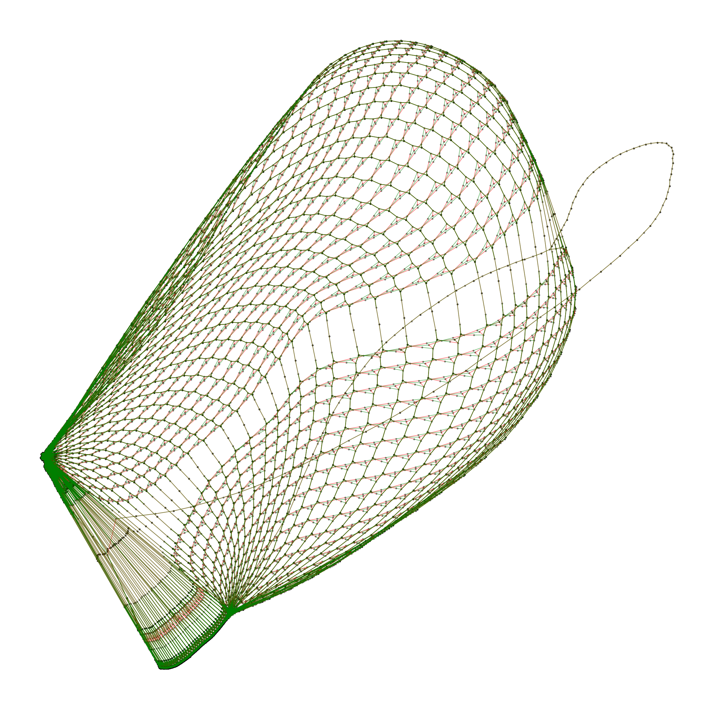
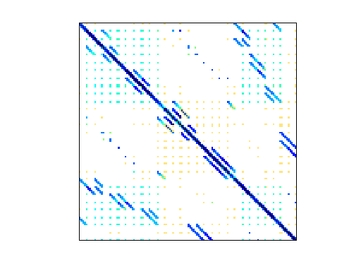
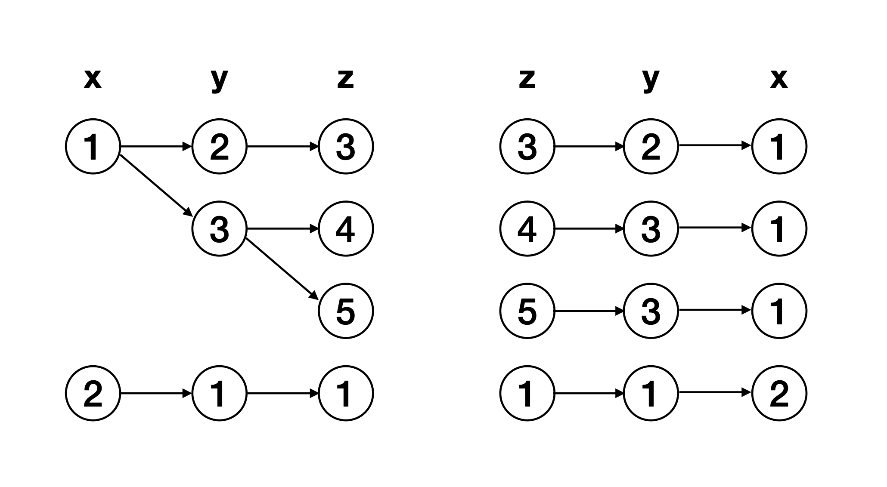

## Introduction
This survey aims to build a modest bridge between the areas of databases and sparse scientific computing. At the core of both fields are two key ingredients: (1) a *representation* of *sparse data* - data for which storing all possible worlds is suboptimal or intractable, and (2) a *mathematical formalism* for computing over sparse data. Clever representations in turn enable nontrivial asymptotic gains in performance, when performing sparse computations. We conclude with some thoughts on where to go next.

### Sparsity in scientific computing
Sparsity in scientific data appears most commonly in the form of sparse matrices. These matrices come from various sources, including:
- physical systems with relatively few pairwise interactions between components, such as particles with local forces,
- linear systems with many variables and constraints, but with few co-appearing variables in each constraint, and
- graphs with $m$ edges on $n$ nodes where $m \ll n^2$.

The last example--sparse graphs--is particularly fundamental, in the sense that the earlier examples can be viewed through the lens of interaction graphs between the variables/components of the underlying system. We can think of an unweighted sparse graph (and its boolean adjacency matrix) as the structural skeleton of a sparse system. The nodes and edges of these graphs are then augmented with domain-specific data.


> Figure 1a. A sparse graph obtained from a boolean satisfiability problem by connecting variables with clauses that they appear in.


> Figure 1b. A sparse matrix derived from a finite difference computation on a 3D mesh. From <https://sparse.tamu.edu/Norris/torso1>.

We can easily generalize sparse graphs to sparse hypergraphs, and consequently sparse matrices to sparse tensors (in the multidimensional array sense). For example, let $A_{xyz}=1$ if there is a hyperedge $(x,y,z)$ and otherwise $0$. Then the tensor $A$ represents a hypergraph with (exactly) 3 nodes per hyperedge. Sparse tensors arise in domains such as quantum chemistry and recommendation models.

### Sparsity in databases
The presence of sparsity in databases is much more immediate. Consider a table $R(\text{name}:\text{string}, \text{salary}:\mathbb{N})$ storing a person's name and their salary. To imagine this table on a real system, let's assume that the strings are lower-case ASCII and have 32 characters max, and that salaries are 32 bit integers. This is our table:

| name  | salary |
| ----- | ------ |
| bob   | 80000  |
| alice | 85000  |

Now what would a dense representation look like? We would need to represent all possible entries of the table, and indicate (by storing a boolean) which entries are actually present. That would look something like this:

|       | 0   | 1   | ... | 80000 | ... | 85000 | ... | 4294967296 |
| ----- | --- | --- | --- | ----- | --- | ----- | --- | ---------- |
| a     | 0   | 0   | 0   | 0     | 0   | 0     | 0   | 0          |
| ...   | ... | ... | ... | ...   | ... | ...   | ... | ...        |
| alice | 0   | 0   | 0   | 0     | 0   | 1     | 0   | 0          |
| ...   | ... | ... | ... | ...   | ... | ...   | ... | ...        |
| bob   | 0   | 0   | ... | 1     | ... | 0     | ... | 0          |
| ...   | ... | ... | ... | ...   | ... | ...   | ... | ...        |
| z...z | 0   | 0   | 0   | 0     | 0   | 0     | 0   | 0          |

This is not a good idea! It is in this sense that tabular data is "naturally" sparse.

## Foundations

Clearly there is a fundamental connection between sparse matrices, tensors, and tables. From a data perspective, they are more or less the same thing. But we are interested in actually doing *something* with the data. We want to run computations and queries over the data. Thankfully, database researchers have thought about computing over sparse data for a long time. We will use graph traversal as our running example for showing how tensor algebra and relational algebra can be unified.

### Example: traversing a graph
Suppose we have a graph stored as a table of edges, and we want to find all pairs of nodes reachable by paths of length exactly 3 in the graph. Relationally, we can consider 3 copies of the graph with appropriately relabeled attributes,

$$
R_1(\text{src},X_1),R_2(X_1,X_2),R_3(X_2,\text{dst}),
$$

over which we compute the natural join and project out our source and destination nodes:

$$
Q = \prod_{\text{src},\text{dst}}R_1\bowtie R_2\bowtie R_3.
$$

If instead we had the adjacency matrix $A$, we could make the following observation:

$$
Q_{ij} = (A^2)_{ij} = \sum_k A_{ik}A_{kj} = \text{number of ways $i$ can reach $j$ in 2 hops},
$$

as the product $A_{ik}A_{kj}$ is 1 if node $k$ bridges $i$ and $j$, otherwise 0. It follows inductively that

$$
Q_{i\ell} = (A^3)_{i\ell} = \sum_j (A^2)_{ij} A_{j\ell} = \text{number of ways $i$ can reach $\ell$ in 3 hops.}
$$

The pairs we want are exactly the indices $(i,\ell)$ for which $Q_{i\ell}$ is nonzero (and in this case, positive). We can also write this in one fused tensor algebra expression, since the multiplication by $A_{j\ell}$ distributes over the sum:

$$
Q_{i\ell} = \sum_j \left(\sum_k A_{ik}A_{kj}\right)A_{j\ell} = \sum_{k,j} A_{ik}A_{kj}A_{j\ell}.
$$

The similarity to the relational algebra query is of course not a coincidence. Note that $Q_{i\ell}$ tells us the number of paths of length 3 from $i$ to $\ell$, while $Q(\text{src},\text{dst})$ just tells us if there is such a path. We assume set semantics for the relational query, but the reader is encouraged to pause and think about what happens under bag semantics.

**Minimizing distance.**
Now what if, instead of detecting such paths, we wanted to find the (minimum) distance between pairs of nodes when taking paths of length 3? In the relational approach, we would first need to augment the table with a weight associated to each edge:

$$
R_1(\text{src},X_1, W_1), R_2(X_1, X_2, W_2), R_3(X_2, \text{dst}, W_3)
$$

The result could then be computed by joining the three relations as before, grouping by $\text{src}$ and $\text{dst}$, and aggregating by taking the minimum of the sum of the edge weights.

$$
Q = \gamma_{\{\text{src},\text{dst}\},\min(W_1+W_2+W_3)\text{ as } W}(R_1\bowtie R_2\bowtie R_3)
$$

On the other hand, if we interpret $A_{ij}$ as a number storing the weight of edge $(i,j)$, with missing edges treated as $\infty$, we can write the computation as

$$
Q_{i\ell} = \min_{j}\left(\min_k A_{ik} + A_{kj}\right) + A_{j\ell}.
$$

This mirrors our previous expression for counting the number of paths, where we first computed the results for paths of length 2. Curiously, addition distributes over min, so we can just write

$$
Q_{i\ell} = \min_{j,k} A_{ik} + A_{kj} + A_{j\ell}.
$$

We are now ready for the punchline.

### Semirings and S-relations
What we have just seen are three instances of *semirings*. We will give a formal definition below.

**Definition 1.** A *semiring* is a tuple $(S,\oplus,\otimes,0,1)$ where

- $\oplus:S\times S\to S$ is associative and commutative with identity $0$,
- $\otimes:S\times S\to S$ is associative with identity $1$ and annihilator $0$, and
- $\otimes$ distributes over $\oplus$ on the left and right, i.e. $a\otimes(b\oplus c) = a\otimes b\oplus a\otimes c$ and $(b\oplus c)\otimes a = b\otimes a\oplus c\otimes a$.

We will assume that $\otimes$ is commutative, in which case the semiring is said to be commutative.

When we counted the number of paths between nodes by calculating $A^3$, we were computing over the $(\mathbb{N},+,\cdot,0,1)$ semiring. This precisely captures bag semantics. When we found the minimum distance, we were using the $(\mathbb{R}\cup\{\infty\},\min,+,\infty,0)$ semiring (also called the min-tropical semiring). Finally, when we only cared about the presence of a path, we were in the Boolean semiring $(\mathbb{B},\lor,\land,\bot,\top)$. This captures set semantics. In our graph traversal example, the same matrix multiplication interpreted over different semirings was all we needed.

An $S$-relation is the natural generalization of standard relations from databases to those that carry values over an arbitrary semiring $S$. They were introduced by Green, Karvounarakis, and Tannen in 2007 for database provenance tracking [^1]. The original idea was to tag input tuples with unique values that propagate through query operators in a specific way, so that the provenance (think "source" or "cause") of an output tuple can be recovered from the tagged value. We will give a simplified formalism for $S$-relations.

**Definition 2.** A *schema* is just a cartesian product of sets $\Gamma = A_1\times\cdots\times A_n$. The sets $A_i$ are the *attributes domains* of the schema. We will abuse notation and refer to the $A_i$s as attributes (in the symbol/variable sense). Additionally, we will freely reorder schemas as needed. We will use capital boldface ($\mathbf{A}$) to indicate a tuple of attributes, and lowercase boldface ($\mathbf{a}$) to indicate concrete values from the attribute domains (i.e. $\mathbf{a}\in\mathbf{A}$).

**Definition 3.** Given a schema $\Gamma$, an *$S$-relation* over $\Gamma$ is a function $R: \Gamma \to S$ with the restriction that it has *finite support.* That is, the set $\text{supp}\subseteq \Gamma$ such that $R(\text{supp})\neq 0$ is finite, where 0 is the additive identity of $S$. $S$-relations map (ordinary database) tuples to semiring values. The finiteness of $S$-relations will be important later.

**Example 1.** A *tensor* is an $S$-relation $T$ over $\Gamma = [d_1]\times\cdots\times[d_n]$, where $[k]=\{0,\dots,k-1\}$ for $k \in \mathbb{Z}^+.$ The *rank* of $T$ is $n$, and $d_i$ is the size of the $i$th *dimension*. While any $S$-relation with finite attribute domains is isomorphic to a tensor, computations over tensors often involve (integer) arithmetic over their attributes. This is to the best of our knowledge uncommon in database queries, and is one of many *geometric* properties of tensors that distinguishes them.

### S-relational algebra
We have already seen how to translate joins and projections over standard relations into those over $S$-relations: $\bowtie$ is $\otimes$, and $\prod$ is (confusingly) $\oplus$.

**Natural join.** Given $R_1$ and $R_2$ with $\Gamma(R) = \mathbf{A}_1\times\mathbf{A}$ and $\Gamma(R')=\mathbf{A}\times \mathbf{A}_2$, we have

$$
[[R_1\bowtie R_2]](\mathbf{a}_1,\mathbf{a},\mathbf{a}_2) = R_1(\mathbf{a}_1,\mathbf{a})\otimes R_2(\mathbf{a},\mathbf{a}_2).
$$

In other words, the semiring value of a join output tuple is the product of the values of the input tuples that matched on the shared attributes.

**Projection.** Projection is a sum over the unprojected attributes: given $R$ with $\Gamma(R) = \mathbf{A}\times \mathbf{A}'$,

$$
[[\prod_{\mathbf{A}'} R]](\mathbf{a}') = \bigoplus_{\mathbf{a} \in \mathbf{A}} R(\mathbf{a}, \mathbf{a}').
$$

Note that the sum ranges across *all* values $\mathbf{a}$ in the attribute domains $\mathbf{A}$. This is well defined, since $R$ has finite support; in other words, we sum over the values that are present in the physical table.

**Union.** Union of relations with the same schema is elementwise addition:

$$
[[R_1\cup R_2]](\mathbf{a}) = R_1(\mathbf{a})\oplus R_2(\mathbf{a}).
$$

#### What about the rest?
**Selection.** We can actually support selection in the $S$-relation framework, if we carefully allow the usage of relations with infinite support. The trick is to introduce an auxiliary relation that encodes the predicate as truth table. For example, to select elements of a matrix below the diagonal, we would transform

$$
\sigma_{\text{col}<\text{row}}(A) \leadsto A \bowtie \text{LessThan},
$$

where $\text{LessThan}(\text{col},\text{row})$ is $1$ when $\text{col} < \text{row}$ and 0 otherwise. Of course, $\text{LessThan}$ is infinitely large, if $\text{col}$ and $\text{row}$ are unbounded. However, we are joining it with a finite relation, so we could just "iterate" over $A$ and (quickly!) look up the value in $\text{LessThan}$.  This style of selection was explored in the context of $S$-relational algebra by [^2], and in a more traditional setting
by [^3].

**Aggregation**. Aggregation is replaced by sum and product. The "group-by" attributes are the free variables in the sum, and the aggregation function is induced by the choices of semiring and which column(s) store the semiring values. Note that you can interleave different summation operators, as long as you are careful about maintaining the semiring properties (but dropping commutativity between the different sums). In general, SQL aggregations may be more expressive, since the operators aren't required to obey the semiring properties. For example, `AVG` is not associative.

**Negation.** Negation is much more subtle, and not generally well defined for arbitrary semirings. Indeed, the "semi" qualifier of "semiring" explicitly drops the existence of additive inverses. One option is to support negation as an uninterpreted function on the underlying set of the semiring. For example, the relational difference $A - B$ in bag semantics can be interpreted as $A \oplus (-B)$, where $-B$ multiplies each tuple multiplicity in $B$ by $-1$. 

We will see later how to support negation for a special type of semiring, in the context of seminaive evaluation.

### Recursion
While the above algebra captures a good chunk of relational and linear algebraic workloads, it misses a key feature of many computations: recursion. A classic result from logic is that first-order logic (of which relational algebra is a subset of) cannot express the transitive closure of a graph. This motivated the development of datalog, which builds upon relational algebra to express *fixed point* computations. Quickly summarized, datalog programs consist of a set of queries together with a set of input tuples called the extensional database (EDB). The queries are then executed on the inputs to form the intensional database (IDB), in a loop, until the results no longer change. All datalog programs terminate in polynomial time with respect to the size of the EDB.

This iteration is often described using the *immediate consequence operator* $T$, which takes as input the current IDB, and outputs the new IDB resulting from computing all queries on the input. With some abuse of notation, we can write the execution of a datalog program as computing $T(\emptyset)$, $T(T(\emptyset))$, and so on. Two critical properties of this iteration are that: (1) $T$ is monotone with respect to $\subseteq$, and (2) the least fixed point of $T$ exists and is finite in size. By exploiting idempotence, datalog evaluation can also be made far more efficient via the semi-naive algorithm, which computes only the *difference* at each iteration instead of rederiving previously derived facts.

If we want to generalize datalog to arbitrary semirings, we need to think about these properties. What partial order should $T$ be monotone with respect to, and what does this require of our semiring operators? Does $T$ have a least fixed point, and can it even be computed in finite time? How do we do semi-naive?

#### Datalogo
The original provenance semirings paper suggests using formal power series over $\omega$-continuous, naturally ordered semirings [^1]. In the interest of space and time, we will instead briefly summarize the approach taken by the datalogo paper by Abo Khamis et al. [^4].

The main idea with datalogo is to define a separate partial order $\sqsubseteq$ on the semiring, as opposed to using the natural order $a \leq b$ defined as having some $c$ such that $a\oplus c = b$. The semiring operators $\oplus$ and $\otimes$ are then required to be monotone with respect to $\sqsubseteq$: if $a\sqsubseteq c$ and $b\sqsubseteq d$, then $a\oplus b\sqsubseteq c\oplus d$, and likewise for $\otimes$. The existence of a least fixed point as well as convergence is characterized algebraically by a property of the semiring called *stability.* In short, the stability of a semiring tells us how countably infinite sums collapse to finite sums. The authors focus on *linear* datalog programs, in which all rules contain at most a single IDB predicate. An additional property important for convergence is that the semiring $\otimes$ be *strict*, which means that $a\otimes \bot = \bot$ where $\bot$ is the least element of $\sqsubseteq$.

The authors also generalize semi-naive evaluation to work over *distributive dioids*, which are naturally ordered, $\oplus$-idempotent semirings that are also distributive lattices. For distributive dioids, subtraction is defined by

$$
b - a \equiv \bigwedge\{c\mid a + c\sqsupseteq b\}.
$$

The authors note that the min-tropical semiring with $\geq$ as the partial order is a distributive dioid, with subtraction

$$
b - a = b~\text{if}~b \leq a ~\text{else}~ \infty.
$$

Semi-naive using this subtraction operator recovers the common shortest-paths optimization.

## Optimization
Naturally, we want to optimize these semiring programs. In this section, we will show how thinking about joins from a sparse tensor perspective naturally leads to a *worst-case optimal* join algorithm, which was a breakthrough result from database researchers in the last decade. This optimization is rooted in a *factorization* of the underlying data, a technique that is ubiquitous in sparse computing but much rarer in databases until recently.

### Factorized Representations
The most familiar representation of a database table is as a list of tuples. This list can be stored either row-wise or column-wise with different tradeoffs, but in general all tuple elements are explicitly stored (modulo certain compression optimizations). On the other hand, this "listings" format is quite rare in high-performance sparse computing. For example, graph algorithms rarely use a list of edges, but instead use an adjacency list structure, where all neighbors of a node are packed and accessed together. Analogously, a sparse matrix is often stored as a *compressed sparse row* (CSR) matrix, which is effectively a compact adjacency list data structure. In both cases, the tuples are stored in a *factorized* form - the tuple elements have a distinguished order with which they must be accessed, and duplicated values are elided according to this order.

To make things concrete, consider the table $R(x,y,z)$ depicted below:

|  **x**  |  **y**  |  **z**  |
| --- | --- | --- |
|  1  |  2  |  3  |
|  1  |  3  |  4  |
|  1  |  3  |  5  |
|  2  |  1  |  1  |

Alternatively, we may factorize $R$ by storing it in a trie, like this:



Mathematically, this representation is factorized in the sense that set $\times$ distributes over $\cup$:

$$
\begin{alignat*}{6}
    R &=      &&\{1\}&&\times{}(&&\{2\}&&\times{} &&\{3\} \\
      &       &&     &&         &&\cup{}&&         &&      \\
      &       &&     &&         &&\{3\}&&\times{}(&&\{4\} \\
      &       &&     &&         &&     &&         &&\cup{}      \\
      &       &&     &&         &&     &&         &&\{5\}))\\
      & &&\cup{}     &&         &&    &&         &&      \\
      & &&\{2\}&&\times{} &&\{1\}&&\times{} &&\{1\}.
\end{alignat*}
$$

An effect of factorization is that different attribute orderings no longer result in isomorphic storage representations. In the listings format, all permutations of attributes result in the same memory footprint. With a factorized representation, different orderings lead to different values being stored. Accessing attributes out of order is also highly inefficient. So why would we want a factorized representation?

### Worst-case optimality: it's intersections all the way down
Sparse representations avoid storing unnecessary information. But space (obviously) isn't the whole story. We need a way to perform computations over sparse data efficiently: we don't want to spend any more time than the space we use. To be more precise, we'd like our runtime to be somehow proportional to the size of the output, asymptotically. The key to achieving such guarantees, in the context of joins, is efficiently computing *intersections* - after all, a join can be defined as the cartesian product of all input attributes filtered by their intersection on shared attributes. We'll see how to be smart with intersections by working through the infamous triangle query, from a sparse tensor algebra perspective.

#### The triangle query
Let's modify the query we saw earlier. Instead of all paths of length 3, we are now only interested in paths of length 3 that start at end at the same vertex - triangles. Let's start by listing all the triangles. For notational clarity, we'll switch to a relational calculus with explicit variables in place of implicit attributes:

$$
Q(i,k,j) = R(i,k)\bowtie R(k,j)\bowtie R(i,j).
$$

<span>
How might we compute this? Mainstream database systems would emit a *binary join plan*, which amounts to computing one join first, materializing the result, then joining the intermediate with the remaining relation. If $|R|=N$, this results in a worst-case runtime of $O(N^2)$. However, it is a fact that a graph with $N$ edges has $O(N^{1.5}$) triangles (see the appendix for a very short proof).
</span>

We can also do something similar using linear algebraic operations:

$$ Q^{\text{wedges}} = A\odot (A^2) = \sum_k A_{ik}A_{kj}A_{ij} $$
$$ Q^\text{triangles} = \text{tr}(A^3) = \sum_{i,k,j} A_{ik}A_{kj}A_{ij} $$

where $Q^\text{wedges}_{ij}$ gives the number of triangles that $i$ and $j$ participate in, and $Q^\text{triangles}$ is the total number of triangles in $A$ (technically with some overcounting). Here $\odot$ is element-wise multiplication. In both cases, materializing the intermediate product $A^2$ results in a runtime of $O(N^2)$, by the reduction to binary joins above.

#### Factorization enables efficient intersections

**From dense to sparse loops.** Consider the following code that computes the triangle count $\sum_{i,k,j} A_{ik}B_{kj}M_{ij}$, assuming $A\in\mathbb{R}^{I\times K},B\in\mathbb{R}^{K\times J},M\in\mathbb{R}^{I\times J}$ are all dense:
```
count = 0
for i in range(I):          # iterate over rows of A and M
    for k in range(K):      # iterate over columns of A, rows of B
        for j in range(J):  # iterate over columns of B, columns of M
            count += A[i,k] * B[k,j] * M[i,j]
```
This is more or less a direct translation of the tensor algebra expression. Now suppose the inputs are actually sparse; what would we need to change to make this work? The first thing we should do is the following: for each loop, only run the body when a value is present for all inputs. Intuitively, given a specific binding of values `(i,k,j)`, the product in the body evaluates to zero if *any* of the matrices lack a value at the indices being looked up. Adding zero does just as much as skipping the loop entirely. In other words, each loop variable should iterate over the *intersection* of the inputs' values on that dimension:
```
count = 0
for i in A.i ∩ M.i:
    for k in A.k ∩ B.k:
        for j in B.j ∩ M.j:
            count += A[i,k] * B[k,j] * M[i,j]
```
We haven't actually described how to compute this intersection. An important subtlety here is that the values of `k` depend on `i`; more precisely, the *sets* `A.k` and `B.k` depend on which `i` values survive the intersection above. We don't want to iterate over `k`s for which there isn't even a relevant `i` in `A` and `M`! This dependency is due to the *variable ordering* we have chosen. Luckily, using factorized representations for our inputs solves this:
```
count = 0
# A: i -> j -> value
# B: j -> k -> value
# M: i -> j -> value
for i in A:
    if i not in M
        continue
    for k in A[i]:
        if k not in B:
            continue
        for j in B[k]:
            if j not in M[i]:
                continue
            count += A[i][k] * B[k][j] * M[i][j]
```
In this code, we iterate over one of the sets in the intersection and probe the other sets for hits. As it turns out, if we always choose the smallest set to iterate over, we recover Generic Join - a worst case optimal join algorithm [^5]. In other words, the count is computed in time $O(N^{1.5})$.

#### Further reading

**Sparse tensor compilers.** This flavor of sparse loop iteration was studied deeply by the TACO (Tensor Algebra Compiler) project [^6]. They developed a compiler that emits efficient code for coiterating factorized tensors (i.e., iterating over intersections) and performing computations. For optimizations, TACO follows the Halide philosophy of separating the compute definition from its low-level implementation (the schedule). TACO's optimizations are mainly loop-centric, including loop tiling, untiling (sometimes called fusion), and reordering. Although originally intended for numerical applications, subsequent work incorporated user-defined functions including support for arbitrary semirings [^7].

**Factorization in databases.** idea of factorizing sparse data for efficient computation has been extensively explored by the Factorized Databases (FDB) Research group led by Dan Olteanu [^8]. This line of research has resulted in implementations of scalable in-database machine learning, which would otherwise be infeasible using traditional machine learning frameworks [^9]. On the theory side, the group has also shown how factorization is deeply connected to further worst-case optimal results such as the work by Ngo et al on sum-product queries [^10]. 

## Closing Remarks, and Next Steps

This survey has hopefully shown how sparse computations and relational query processing can be seen as branches of a shared underlying formalism. As a core example, thinking in terms of sparse loops enables joins to be computed asymptotically faster. Of course, the fields of sparse computing and databases have diverse motivations, constraints, and technologies, so it would be foolish to conflate them. However, bringing them closer together can only help useful ideas proliferate. In the remainder of this section, we'll free associate on some next steps.

## Traditional and worst-case optimal query planning

Worst-case optimal join is robust to variable ordering, asymptotically. But practically, the trie from earlier shows how a "bad" ordering can lead to unnecessary duplication. Additionally, constructing and maintaining a trie for every table is potentially a lot of work. Free Join [^11] addresses these problems by using a traditional database optimizer to generate a variable ordering, and materializes the trie lazily from columnar data to reduce preprocessing cost. This two-staged approach works surprisingly well, but the idea of a factorized-native optimizer remains tantalizing. Interesting questions include:

-   what kind of factorized statistics could we compute and utilize, beyond traditional column-level statistics like histograms?

-   how do we accurately estimate and compare the cost of building tries, table scans, index lookups, and more?

-   how do we *parallelize* factorized joins? do we partition the relations like Gamma [^12], or can we exploit fine-grained loop-level parallelism? how do we achieve load balance in the presence of skew?

## Affine tensor programs

A common feature of tensor programs that was not covered here is the presence of *affine arithmetic* over index variables. For example, in image processing pipelines, an output pixel $(i,j)$ is often a function of its immediate neighborhood $(i-1,j-1), (i,j-1)$ and so on. In dense tensor programs, the *polyhedral* method models iteration spaces as sets defined by affine inequalities, and applies affine transformations to these spaces to improve performance (by improving locality, enabling parallelism, and more). It would be interesting to see how these techniques interact with sparsity and database query planning.

[^1]: Green, T. J., Karvounarakis, G., and Tannen, V. Provenance semirings. In Proceedings of the Twenty-Sixth ACM SIGMOD-SIGACT-SIGART Symposium on Principles of Database Systems (New York, NY, USA, 2007), PODS ’07, Association for Computing Machinery, p. 31–40

[^2]: Khamis, M. A., Curtin, R. R., Moseley, B., Ngo, H. Q., Nguyen, X., Olteanu, D., and Schleich, M. Functional aggregate queries with additive inequalities, 2020.

[^3]: Wang, Q., and Yi, K. Conjunctive queries with comparisons. SIGMOD Rec. 52, 1 (jun 2023), 54–62.

[^4]: Abo Khamis, M., Ngo, H. Q., Pichler, R., Suciu, D., and Wang, Y. R. Convergence of datalog over (pre-) semirings. In Proceedings of the 41st ACM SIGMOD-SIGACT-SIGAI Symposium on Principles of Database Systems (New York, NY, USA, 2022), PODS ’22, Association for Computing Machinery, p. 105–117.

[^5]: Ngo, H. Q., Re, C., and Rudra, A. Skew strikes back: New developments in the theory of join algorithms, 2013.

[^6]: Kjolstad, F. Sparse Tensor Algebra Compilation. Ph.d. thesis, Massachusetts Institute of Technology, Cambridge, MA, Feb 2020.

[^7]: Henry, R., Hsu, O., Yadav, R., Chou, S., Olukotun, K., Amarasinghe, S., and Kjolstad, F. Compilation of sparse array programming models. Proc. ACM Program. Lang. 5, OOPSLA (oct 2021).

[^8]: Olteanu, D., and Závodný, J. Factorised representations of query results: size bounds and readability. In Proceedings of the 15th International Conference on Database Theory (New York, NY, USA, 2012), ICDT ’12, Association for Computing Machinery, p. 285–298.

[^9]: Schleich, M., Olteanu, D., Khamis, M. A., Ngo, H. Q., and Nguyen, X. A layered aggregate engine for analytics workloads, 2019.

[^10]: Khamis, M. A., Curtin, R. R., Moseley, B., Ngo, H. Q., Nguyen, X., Olteanu, D., and Schleich, M. Functional aggregate queries with additive inequalities, 2020.

[^11]: Wang, Y. R., Willsey, M., and Suciu, D. Free join: Unifying worst-case optimal and traditional joins. Proc. ACM Manag. Data 1, 2 (jun 2023)

[^12]: Dewitt, D. J., Ghandeharizadeh, S., Schneider, D. A., Bricker, A., Hsiao, H. I., and Rasmussen, R. The gamma database machine project. IEEE Trans. on Knowl. and Data Eng. 2, 1 (mar 1990), 44–62.

## Appendix

### Proof of the triangle upper bound

<span>
Let $G$ be a graph with $m = |E|$ edges. We will show that show that $\Delta = O(m^{3/2})$, where $\Delta$ is the number of triangles in $G$ up to isomorphism.
</span>

<span>
*Proof.* First, define $$A(u) = \{v \in V \mid v \in N(u) \text{ and }\deg(v)\geq\deg(u)\}.$$
Then, for any triangle $(i, j, k)$ ordered such that $\deg(i) \leq \deg(j) \leq \deg(k)$, we have $k \in A(i) \cap A(j)$. It follows that
$$T' = \bigcup_{(i,j) \in E} A(i) \cap A(j) \subseteq T,\quad\text{and}\quad \Delta \leq |T'|.$$
Now, call vertices with at least $\sqrt{m}$ degree **heavy**, and otherwise **light**. Notice that there are at most $\sqrt{m}$ heavy vertices, otherwise we'd end up with more than $m$ edges. Thus, for every intersection $A(i) \cap A(j)$:
</span>

- <span>if $i$ is light, then $|A(i)| \leq |N(i)| < \sqrt{m}$ so $|A(i) \cap A(j)| < \sqrt{m}$;</span>
- <span>otherwise if $i$ is heavy, then $|A(i)| \leq \sqrt{m}$ since every $v\in A(i)$ must also be heavy, so $|A(i) \cap A(j)| \leq \sqrt{m}$. </span>

<span>
Together, it follows that $|T'| \leq \sum_{(i,j)\in E} \sqrt{m} = m^{3/2}$, which completes the proof. ◻
</span>
