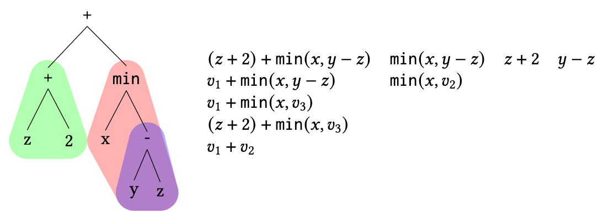
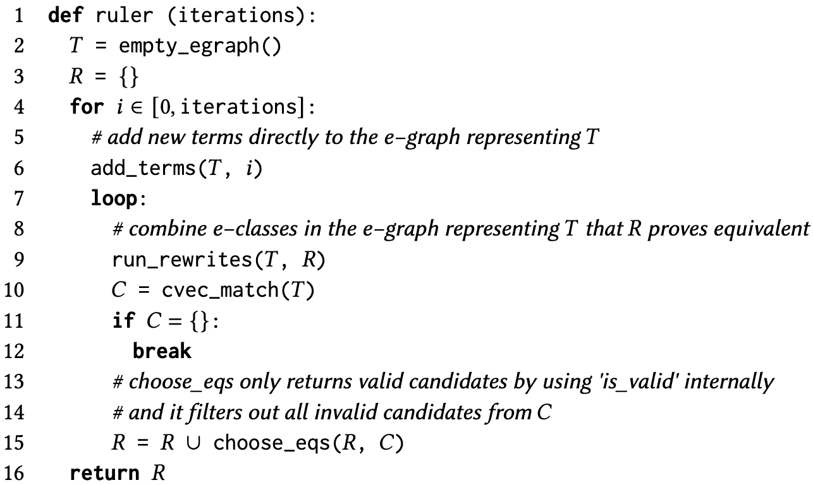
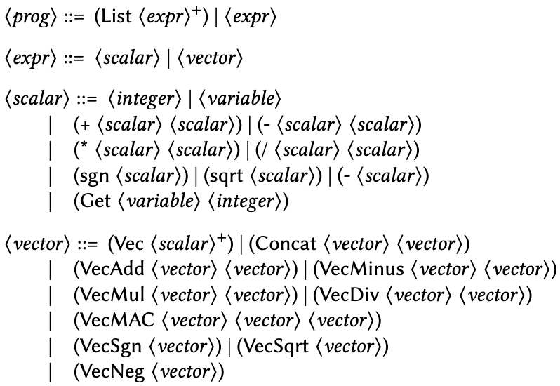

# Introduction

Declarative techniques show great promise in program analysis and
optimization. Rewrite-based techniques allow programmers to declare
template rules which can be applied throughout a program in order to
optimize its performance, memory consumption, or other attributes. Large
optimizations can be built up from many smaller ones, applied in
different orders. Declarative program optimization also allows for
program optimizations to be expressed independently from program
function, and such techniques have been successfully adopted in systems
such as Halide[^13], a domain-specific
language for writing high-performance image processing pipelines. Term
rewriting systems have been applied to more general languages as well;
for example, Haskell has long supported user-written rewrite rules in
the Glasgow Haskell Compiler[^12].
More recently, equality saturation and e-graphs (short for equivalence
graphs) have gained significant attention, with performant
implementations such as the egg library[^18]
enabling e-graphs to be used for a variety of applications, ranging from
tensor graphs[^19] to optimization of
hardware arithmetic datapaths[^4].
E-graphs have even been applied to rewrite rule synthesis, as discussed
later in this work.

Ultimately, most of these applications of declarative techniques rely on
the programmer to manually specify potentially beneficial rewrite rules.
However, writing rewrite rules is not a trivial task. It may not be
clear to the programmer whether certain rewrite rules are beneficial, or
even that they do not unintentionally modify the semantics of the
program or cause any cycles that would prevent the rewrite system from
terminating. The programmer might in some cases not be able to think of
certain rules which would have provided significant benefit.
Consequently, the idea that rewrite rules can be automatically
discovered rather than hand-written is highly appealing. First, in order
to reduce the developer's burden, but also to identify valuable rewrite
rules that may not have been thought of ad hoc, as well as to generate
rewrite rules which are provably correct.

Today, a variety of techniques are used to synthesize rewrite rules, but
the range of potential approaches is wide, and no single accepted
workflow has yet emerged. In this work, we begin by discussing what
makes rewrite rule synthesis difficult, then survey existing approaches,
both from an algorithmic and an infrastructure standpoint. Finally, we
discuss the costs and benefits of rewrite rule synthesis and how methods
for rewrite rule synthesis could be improved in future work.

# Challenges of Rewrite Rule Synthesis

In order to frame the rest of this survey, we now discuss some of the
primary challenges associated with synthesizing rewrite rules. Some of
the key dimensions along which rewrite rule synthesis techniques differ
are as follows:

1.  **Order of enumeration**&mdash;In what order does one enumerate over the
    set of remaining possible expressions (on either side of a rewrite
    rule)? What constraints are there on the size of terms? As the size
    of one's grammar or terms increases, the number of possible rules
    also increases combinatorially, so efficient search becomes more
    important. This can also relate to the relative priority of rewrite
    rules, as some settings may be more amenable to \"shortcut\" rules
    that encapsulate large changes in one rule, whereas others might
    prefer smaller rules that can be combined in different ways to
    explore the full space of rewrites.

2.  **Filtering**&mdash;How do you filter out rewrite rules such that only
    interesting (e.g. useful for optimization, not redundant, etc.) ones
    remain in the search space?

3.  **Verification**&mdash;How do you verify that the rewrite rules you
    generate are correct and improve programs?

Of course, there is no unified approach for different domains, and the
optimal choice in each dimension will vary by the specific programs
under consideration. The metrics that can be used to evaluate the
effectiveness of these tool are less clear, and will be discussed in
this survey on a per-work basis.

# Knuth-Bendix Completion

Knuth-Bendix completion[^6], proposed
in 1970 and named after Donald Knuth and Peter Bendix, is a key
predecessor to rewrite rule synthesis. It is a semidecision procedure
for the word problem, i.e. the problem of deciding whether two
expressions are equivalent with respect to a set of rewrite relations.
Given a base set of equations and a reduction order on terms, if it
succeeds, it provides a confluent and terminating term rewriting system
that can be used to solve the word problem for the given equational
theory. However, it may also fail or not terminate. In order to consider
Knuth-Bendix completion's merits as a rewrite rule synthesis technique,
we can take a look at where it lies along the dimensions discussed [above](#sec:challenges).

1.  **Order of enumeration**&mdash;The order of enumeration is a modifiable
    parameter in Knuth-Bendix completion, where the steps (Delete,
    Compose, Simplify, Orient, Collapse, Deduce) can be run in a
    user-determined order. The general strategy of utilizing known
    equalities to enumerate possible rewrites, as well as simplifying
    rewrites using other known rewrites, are both key techniques that
    can be seen in the other works in this survey.

2.  **Filtering**&mdash;Since Knuth-Bendix completion is based on a set of
    input equations, not on a grammar, the space of possible terms is
    much more limited than tools which attempt to enumerate all possible
    terms in a given grammar. Beyond this inherent constraint, when
    determining whether a rewrite rule is worth creating, the algorithm
    uses the provided reduction order on terms. This is powerful because
    we know that such an ordering exists, and in the algorithm, all
    generated rules $l \rightarrow r$ have $l>r$.

3.  **Verification**&mdash;Huet[^5] showed in
    1980 that when the algorithm terminates, it defines a valid
    semidecision algorithm for the word problem.

As it originates from computational mathematics, the initial examples
provided for the usefulness of Knuth-Bendix completion relate mostly to
group theory and not to actual programming systems. This makes it hard
to evaluate the effectiveness of Knuth-Bendix completion from a
programming systems perspective. However, it has had significant
influence on later work whose value we will discuss more extensively.

# Rewrite Rule Synthesis for Program Optimization

## Halide

*Figure 3 from Newcomb et
al.[^8] explains how LHS
patterns are mined from input expressions. In this case,*
$(z+2)+\texttt{min}(x,y-z)$ *yields the candidate LHS terms on the right.
All possible subterms are enumerated, plus copies of those terms where
subterms of interest (colored in the figure) are replaced by a
variable.*

Halide[^13], a domain-specific language for
high-performance image processing pipelines, utilizes a term rewriting
system with over a thousand hand-written rewrite rules (as of the time
of Newcomb et al.'s rewrite rule synthesis for
Halide[^8]). Newcomb et al.
attempt to recreate Halide's existing rules, as well as generate new
ones by applying program synthesis techniques.

1.  **Order of enumeration**&mdash;Candidate rule LHSs (left-hand sides) are
    enumerated and from input expression of interest, in a bottom-up
    order. RHSs (right-hand sides) are
    generated via 1) "delayed" AC matching, where associativity and
    commutativity are applied to the LHS, and the resulting term is
    passed to the existing TRS, and 2) counterexample-guided inductive
    synthesis (CEGIS), used in sketching for program
    synthesis[^15], to superoptimize the
    LHS.

2.  **Filtering**&mdash;Rules are pruned heuristically based on term size;
    the authors specifically state that terms must have seven or fewer
    leaves. They also keep a blacklist of LHSs which previously failed
    to generate a rule.

3.  **Verification**&mdash;The authors prove that the term rewriting system
    (TRS) terminates, based on a reduction order that closely matches
    the original TRS (eight existing rules had to be removed). They use
    SMT and Coq to prove that the rewrite rules are correct, i.e.
    preserve program semantics.

One particularly interesting aspect of this work is its discussion of
the value of rule synthesis. It mainly frames the value of rewrite rule
synthesis as that of a development tool for someone building a term
rewriting system. Understandably, they are unable to generate all the
existing hand-written rules in Halide's already large corpus of rewrite
rules. However, they are able to identify a number of bugs in the
system, which previously relied on fuzz testing, as well as propose a
number of rewrites that significantly improve memory utilization. The
authors also provide a case study based on rewrite rules added late into
Halide's development, showing that given relevant test expressions,
synthesized rules are superior to hand-written ones with one exception
not supported by CEGIS.

One potential downside this work is the size of the generated set of
rules&mdash;around 4000, which is four times the size of the original large,
hand-written ruleset. The majority of generated rewrite rules do not
provide any benefit, and of those that do, they mainly improve memory
usage and not runtime. This also makes the term rewriting system more
difficult for both humans and verification tools to reason about,
although the the authors state that the added rules had no significant
impact on performance of the compiler itself.

## Ruler

*Figure 4 from Ruler[^7] shows Ruler's core
algorithm. Note that at each iteration, all terms up to size* $i$ *are
added to the e-graph (Line 6, `add_terms()`). Equivalences between these
terms are then identified via fingerprinting, and rewrite rules are
extracted from newly crafted
e-classes.*

Ruler[^7] uses equality saturation as a
rewrite system on the domain of rewrite rules itself. The authors boil
rule inference down into three key steps, and demonstrate the
effectiveness of their approach by implementing rule synthesis for
booleans, bitvectors, and rationals. The three steps are as follows:

1.  **Enumerate** terms into a set $T$. Terms are enumerated from the
    target domain and represented in an e-graph (equality graph), a data
    structure for efficiently managing equivalence classes of terms. As
    shown in the algorithm above, at each iteration, all terms up to a
    specific size are added to the e-graph.

2.  Search $T \times T$ for a set of candidate equalities $C$. Pairs of
    potentially equivalent terms are identified within the e-graph based
    on their characteristic vectors (cvecs), which act as fingerprints
    capturing term behavior under various inputs.

3.  Choose a useful, valid subset of $C$ to add to the ruleset $R$,
    attempting to minimize redundancy and maximize generality. A large
    number of heuristics is used, including favoring more distinct
    variables, fewer constants, shorter larger side (between the two
    terms forming the candidate), shorter smaller side, and fewer
    distinct operators. This encapsulates the **Filtering** step of the
    rule synthesis process.

In terms of performance of the rewrite rule synthesizer, the key idea is
to use e-graphs and equality saturation help make these steps more
efficient. Specifically, the set of terms $T$ is represented using an
e-graph, which is merged iteratively using equality saturation. Rewrite
rule candidates are proposed based on the current set of e-classes,
valid equivalences are applied to the e-graph, and so on in a loop.
However, one key drawback is that given a grammar, Ruler adds *all*
terms of a certain size to the e-graph at each iteration, which means
the number of terms grows combinatorially with the size of the grammar.
As shown in the followup work Enumo[^10], for
grammars like that of Halide, Ruler times out after just one iteration.
Nonetheless, with Herbie[^11], a tool
for improving floating point accuracy whose original ruleset has 52
rules, Ruler demonstrates an ability to outperform a hand-designed
ruleset.

For **Verification**, Ruler supports various validation methods for
candidate rules, and the authors provide their analysis of which
strategies make sense in different scenarios:

-   Model checking: Ideal for small domains where all possible input
    combinations can be exhaustively checked.

-   SMT solving: Suitable for larger domains where symbolic reasoning is
    more efficient than exhaustive testing.

-   Random testing/fuzzing: Useful for domains where formal verification
    is impractical or where a probabilistic guarantee of soundness is
    sufficient.

Ruler also seeks to provide a framework for rewrite rule synthesis that
is more general than those provided in prior work. Specifically, it
allows domain specification via a grammar and an interpreter. Users
provide a grammar that defines the syntax of the target domain, as well
as an interpreter that evaluates expressions and determines their
semantics. Based on these inputs, Ruler is able to enumerate possible
terms within the target domain, as well as compare terms for equivalence
and validate candidate rules.

Additionally, Ruler uses characteristic vectors (Cvecs) as a
generalizable method for equivalence checking. Ruler tags each term in
the set of terms $T$ with a Cvec which captures its value under
different input values. Cvecs act as fingerprints for a quick
equivalence check between terms that does not rely on domain-specific
knowledge or complex symbolic reasoning. This facilitates rule discovery
in diverse domains, even those with partial operators (like division) or
complex semantics.

## Enumo

Enumo[^10] expands on Ruler by proposing a DSL
for rewrite rule synthesis tools. This DSL provides operators that allow
users to \"strategically guide rule inference and incrementally build
rulesets\" by programmatically growing and shrinking the e-graph of
terms, as well as the set of rules.

In addition to the DSL, the key technique Enumo introduces that was not
present in Ruler is \"fast-forwarding,\" where user-provided information
is used to explore more deeply in a suspected good direction. This
specifically modifies the **Order of enumeration** axis, while the
**Filtering** and **Verification** techniques remain similar to Ruler.
Specifically, rule enumeration in Enumo begins with a workload rather
than a full grammar. In Enumo, \"Allowed\" and \"forbidden\" operators
can be specified by the user. Forbidden operators can only be added to
the e-graph via a set of \"exploratory rules,\" also specified by the
user. In the Enumo DSL, the user can design their rule synthesizer to
use different subsets of rules (defined by the operators used in the
rules, i.e. allowed, exploratory, or all) to grow and collapse the
e-graph of terms.

## Isaria

*Figure 1 from Isaria[^16]: the vector DSL
used in Isaria and
Diospyros[^17].*

Diospyros[^17] utilizes e-graphs for
auto-vectorization on digital signal processors (DSPs).
Isaria[^16] rebuilds this tool, but instead
of hand-writing rewrite rules, uses Ruler (with some modifications) to
automatically generate them. The resulting ruleset beats Diospyros
performance in most cases. The modifications to Ruler are as follows:

-   The authors add explicit support for generalizing rules for scalar
    computation to vectors. This prevents scalar rewrites being applied
    to already vectorized code, which doesn't make sense. This
    **Filtering** change helps stop the e-graph of terms from blowing
    up, which as discussed [above](#sec:ruler) is a key challenge with Ruler.

-   Isaria automatically categorize candidate rules into 1) Expansion
    (roughly, scalar to scalar rewrites), 2) Compilation (scalar to
    vector lowering), and 3) Optimization (vector to vector rewrites)
    phases, based on how rules change program cost. These rules are then
    applied in phases during program optimization.

Again, Isaria demonstrates the scaling challenges of grammar-based
rewrite rule synthesis. Despite its vector DSL being quite small (see
figure), the authors must employ domain-specific
strategies that prevent all possible rewrites from being applied to the
term e-graph.

# Rewrite Rule Synthesis for Verification

## CVC4

Nötzli et al.[^9] build a tool that
automatically generating rules to rewrite terms for Satisfiability
Modulo Theories (SMT) solvers. In this case, the goal of rewrites is to
pre-process input terms by simplifying them to a form that is friendly
to the solver. While the objective may differ, we can still investigate
where this work lies on our three axes.

1.  **Order of enumeration**&mdash;In this work, the authors utilize
    Syntax-Guided Synthesis (SyGuS)[^1] to
    enumerate potential rewrite rules starting with a grammar.
    Enumeration starts with smaller terms and progressively explores
    larger ones while adhering to a specified size limit. This
    prioritizes \"simpler\" rewrite rules.

2.  **Filtering**&mdash;The user provides a SyGuS specification, which
    \"acts as a filtering mechanism to discard terms that should not be
    included in rewrite rules.\" In addition, this work employs multiple
    techniques to filter out redundant or uninteresting terms,
    including:

    -   Matching: Eliminates terms that are instances of previously
        generated rewrite rules.

    -   Variable Ordering: Discards terms where variables appear in a
        non-canonical order, assuming a certain symmetry in the grammar.

    -   Congruence Closure: Removes terms that can be deduced from
        existing rules through congruence reasoning.

3.  **Verification**&mdash;The paper introduces an optional mode in CVC4
    that checks the soundness of the generated rewrite rules. This mode
    employs grammar-based sampling to find potential counterexamples
    where the original term and its rewritten form have different
    values.

In addition, this work discusses the wide range of metrics that could be
considered for the rewrite rule synthesis problem, and discusses how
their workflow fares under those metrics. Specifically, the authors ask
four questions:

-   How does the number of unique terms scale with the number of grammar
    terms?

-   How do rewriters affect term redundancy and enumeration performance?

-   What is the accuracy and performance of different equivalence
    checks?

-   How many candidate rewrites do our filtering techniques eliminate?

This discussion can be found in Section 5 of the original work. Overall,
the authors find that their solution performs better than existing ones
in enumeration performance and equivalence checking. However, it is
notable that for the larger grammars, the tools is unable to scale past
2 or 3 terms&mdash;in line with observations from previous works which
enumerate terms based on a grammar (albeit with filtering).

## Theory Exploration

Theory
exploration[^2][^3]
is an approach to generating lemmas for verification, where valid lemmas
are eagerly generated rather than being guided by a proof goal or
written by hand. These lemmas can be viewed as analogous to rewrite
rules, since they represent bidirectional equivalence relations used to
modify expressions into a more useful state. In fact,
Enumo[^10], discussed above, is presented as a
theory exploration tool. Since this survey is primarily focused on
program optimization, we will briefly discuss one related work; however,
this is far from a comprehensive survey of theory exploration.

TheSy[^14] introduces a *symbolic*
technique for theory exploration. Like in Ruler and Enumo, the authors
utilize grammar-based enumeration and build an e-graph of terms. They
call their technique Syntax-Guided Enumeration, or SyGuE. Unlike these
works, TheSy uses symbolic observational equivalence (SOE), where terms
are equivalence-checked on symbolic inputs. Redundant conjectures are
filtered out and remaining ones are verified using induction based on
algebraic data structure definitions. Overall, the similarity of this
work to the above, even when the objective is verification rather than
optimization, is noteworthy.

# Conclusion and Future Directions

## Why synthesize rewrite rules?

The premise of being able to generate rewrite rules from scratch,
without needing to provide program or rule examples, is enticing.
However, one of the main challenges of rewrite rule synthesis is scaling
to larger sizes of grammar and rules. Methods that generate rewrite
rules directly from a grammar (Ruler and Isaria) fail to terminate once
expanded beyond academic examples. Isaria makes this type of
grammar-based rule synthesis more tractable by preventing certain
rewrites from being applied based on domain characteristics of their
vector DSL. Enumo tackles the problem by designing a DSL which provides
the ability to restrict synthesis with user-provided information.
Newcomb et al., after working with Halide, a production-scale language,
suggest that rewrite rule synthesis should be treated as a tool more as
a tool to aid developer productivity, rather than a means to replace any
and all rule-writing in program optimization.

Synthesizing rewrite rules has many potential benefits. As seen in this
survey, the use cases range from auto-vectorization to improving
floating point accuracy to formal verification. However, the actual
metrics used to evaluate rewrite rule synthesis vary greatly depending
on the setting, and as seen in the CVC4 work from Nötzli et al., there
are a number of questions we can ask regarding just how well our rule
synthesis system is working. Improvements in performance (of the
resulting system), improved verifiability, and reduced engineering
effort are some of the examples of how synthesizing rewrite rules might
help developers of programming systems. That being said, rewrite rule
synthesis might not make sense for all systems. For example, without a
starting point or a good heuristic for which rewrite rules are more
beneficial than others, it is difficult to search over the space of
possible rewrite rules, particularly if they can be larger than one or
two operators in size. In these cases, or if you just want to implement
a few basic optimizations, it might make sense to hand-write your
rewrite rules (or if they are simple enough, perhaps a large language
model could suggest them).

## What questions remain?

Ruler and Enumo are interesting because they try to generalize the
rewrite rule inference problem and develop frameworks that can apply to
a range of domains. One question that has not been heavily explored in
the space of rewrite rule synthesis is engineering effort. For a given
domain, would it take more time to implement a rule synthesis tool for
that domain, or manually write a similarly effective (and more
human-interpretable) set of rewrite rules? This is a question that may
be difficult to systematically evaluate, but its answer has practical
value. Of course, the development of new, more generally applicable
rewrite rule synthesis techniques and frameworks will change the
calculus here.

We have seen that providing synthesizers with example programs and rule
heuristics can help them scale. Generally speaking, these examples and
heuristics are encoded by the developer of the synthesizer. Cost models
for terms exist, and are currently used by rewrite rule synthesizers
like Isaria, but are not necessarily used to guide enumeration and
filtering during the rule synthesis process. Could cost models be used
to guide the order in which rewrite rules are enumerated, and filter
rewrite rules that, say, have a left-hand side which is already
performance-optimized? Furthermore, are there new methods which could be
used to generate example programs or rules? And how else could scaling
challenges be addressed?

Generally, the implemented systems for rewrite rule synthesis replace an
existing system, which already have a set of rules that can be used for
comparison. It will be interesting to see whether rewriting systems of
the future can be built from the ground up with rewrite rule synthesis,
or if rewrite rule synthesis will primarily serve as a helpful tool for
developers of such systems, as Newcomb et al. proposed. Rewrite rule
synthesis is an emerging area of research, and the projects discussed in
these surveys are pioneering works in the domain. While we have seen a
number of impactful use cases for rewrite rule synthesis in this survey,
there may be many more yet to be discovered.

# References

[^1]: Rajeev Alur, Rastislav Bodik, Garvit Juniwal, Milo M. K. Martin, Mukund Raghothaman, Sanjit A. Seshia, Rishabh
    Singh, Armando Solar-Lezama, Emina Torlak, and Abhishek Udupa. 2013. Syntax-guided synthesis. In 2013 Formal
    Methods in Computer-Aided Design. 1–8. https://doi.org/10.1109/FMCAD.2013.6679385

[^2]: Bruno Buchberger. 2000. Theory Exploration with Theorema. Analele Universitatii Din Timisoara, Seria Matematica Informatica XXXVIII (01 2000), 9–32.

[^3]: Bruno Buchberger, Adrian Cr ˇaciun, Tudor Jebelean, Laura Kovács, Temur Kutsia, Koji Nakagawa, Florina Piroi,
    Nikolaj Popov, Judit Robu, Markus Rosenkranz, and Wolfgang Windsteiger. 2006. Theorema: Towards computer-aided
    mathematical theory exploration. Journal of Applied Logic 4, 4 (2006), 470–504. https://doi.org/10.1016/j.jal.2005.10.006
    Towards Computer Aided Mathematics.

[^4]: Samuel Coward, George A. Constantinides, and Theo Drane. 2023. Automating Constraint-Aware Datapath Optimization using E-Graphs. arXiv:2303.01839

[^5]: Gérard Huet. 1981. A complete proof of correctness of the Knuth-Bendix completion algorithm. J. Comput. System Sci.  23, 1 (1981), 11–21. https://doi.org/10.1016/0022-0000(81)90002-7

[^6]: Donald E. Knuth and Peter B. Bendix. 1970. Simple Word Problems in Universal Algebras. In Computational Problems in Abstract Algebra, JOHN LEECH (Ed.). Pergamon, 263–297. https://doi.org/10.1016/B978-0-08-012975-4.50028-X

[^7]: Chandrakana Nandi, Max Willsey, Amy Zhu, Yisu Remy Wang, Brett Saiki, Adam Anderson, Adriana Schulz, Dan Grossman, and Zachary Tatlock. 2021. Rewrite Rule Inference Using Equality Saturation. Proc. ACM Program. Lang. 5, OOPSLA, Article 119 (oct 2021), 28 pages. https://doi.org/10.1145/3485496

[^8]: Julie L. Newcomb, Andrew Adams, Steven Johnson, Rastislav Bodik, and Shoaib Kamil. 2020. Verifying and improving Halide’s term rewriting system with program synthesis. Proc. ACM Program. Lang. 4, OOPSLA, Article 166 (nov 2020), 28 pages. https://doi.org/10.1145/3428234

[^9]: Andres Nötzli, Andrew Reynolds, Haniel Barbosa, Aina Niemetz, Mathias Preiner, Clark Barrett, and Cesare Tinelli. 2019. Syntax-Guided Rewrite Rule Enumeration for SMT Solvers. In Theory and Applications of Satisfiability Testing – SAT 2019, Mikoláš Janota and Inês Lynce (Eds.). Springer International Publishing, Cham, 279–297.

[^10]: Anjali Pal, Brett Saiki, Ryan Tjoa, Cynthia Richey, Amy Zhu, Oliver Flatt, Max Willsey, Zachary Tatlock, and Chan- drakana Nandi. 2023. Equality Saturation Theory Exploration à la Carte. Proc. ACM Program. Lang. 7, OOPSLA2, Article 258 (oct 2023), 29 pages. https://doi.org/10.1145/3622834

[^11]: Pavel Panchekha, Alex Sanchez-Stern, James R. Wilcox, and Zachary Tatlock. 2015. Automatically improving accuracy for floating point expressions. SIGPLAN Not. 50, 6 (jun 2015), 1–11. https://doi.org/10.1145/2813885.2737959

[^12]: Simon Peyton Jones, Andrew Tolmach, and Tony Hoare. 2001. Playing by the rules: rewriting as a practical optimisation technique in GHC. In 2001 Haskell Workshop (2001 haskell workshop ed.). ACM SIGPLAN. https://www.microsoft.  com/en-us/research/publication/playing-by-the-rules-rewriting-as-a-practical-optimisation-technique-in-ghc/

[^13]: Jonathan Ragan-Kelley, Connelly Barnes, Andrew Adams, Sylvain Paris, Frédo Durand, and Saman Amarasinghe. 2013. Halide: a language and compiler for optimizing parallelism, locality, and recomputation in image processing pipelines. In Proceedings of the 34th ACM SIGPLAN Conference on Programming Language Design and Implementation (Seattle, Washington, USA) (PLDI ’13). Association for Computing Machinery, New York, NY, USA, 519–530. https://doi.org/10.1145/2491956.2462176

[^14]: Eytan Singher and Shachar Itzhaky. 2021. Theory Exploration Powered by Deductive Synthesis. Springer International Publishing, 125–148. https://doi.org/10.1007/978-3-030-81688-9_6

[^15]: Armando Solar-Lezama. 2009. The Sketching Approach to Program Synthesis. In Programming Languages and Systems, Zhenjiang Hu (Ed.). Springer Berlin Heidelberg, Berlin, Heidelberg, 4–13.

[^16]: Samuel Thomas and James Bornholt. 2024. Automatic Generation of Vectorizing Compilers for Customizable Digital Signal Processors. In Proceedings of the 29th ACM International Conference on Architectural Support for Programming Languages and Operating Systems, Volume 1 (La Jolla, CA, USA,) (ASPLOS ’24). Association for Computing Machinery, New York, NY, USA, 19–34. https://doi.org/10.1145/3617232.3624873

[^17]: Alexa VanHattum, Rachit Nigam, Vincent T. Lee, James Bornholt, and Adrian Sampson. 2021. Vectorization for digital signal processors via equality saturation. In Proceedings of the 26th ACM International Conference on Architectural Support for Programming Languages and Operating Systems (Virtual, USA) (ASPLOS ’21). Association for Computing Machinery, New York, NY, USA, 874–886. https://doi.org/10.1145/3445814.3446707

[^18]: Max Willsey, Chandrakana Nandi, Yisu Remy Wang, Oliver Flatt, Zachary Tatlock, and Pavel Panchekha. 2021.  egg: Fast and extensible equality saturation. Proc. ACM Program. Lang. 5, POPL, Article 23 (jan 2021), 29 pages.  https://doi.org/10.1145/3434304

[^19]: Yichen Yang, Phitchaya Mangpo Phothilimtha, Yisu Remy Wang, Max Willsey, Sudip Roy, and Jacques Pienaar. 2021. Equality Saturation for Tensor Graph Superoptimization. In Proceedings of Machine Learning and Systems.  arXiv:2101.01332