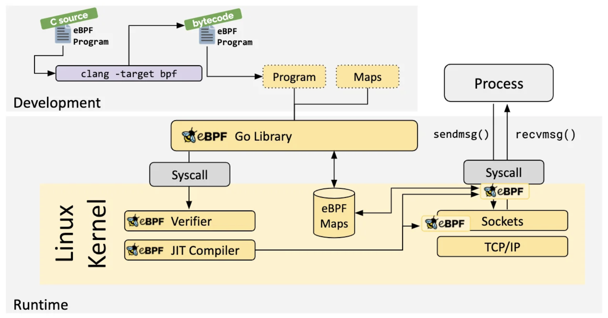
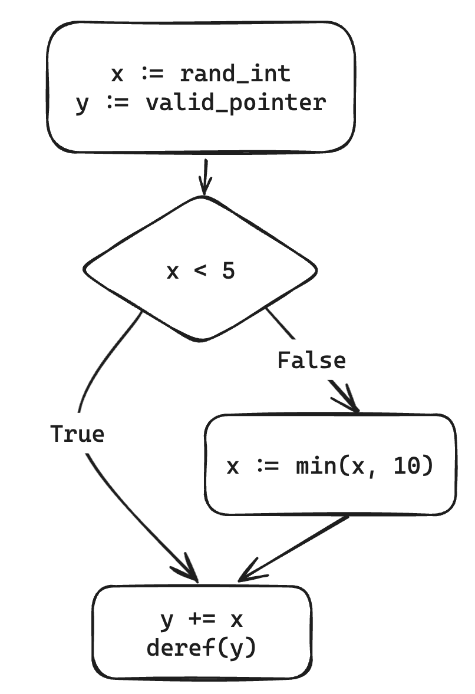
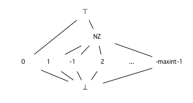

## eBPF Overview

Extended Berkeley Packet Filter (eBPF) is a framework which allows safe execution of user-provided programs in a privileged context within an operating system kernel [^1]. It effectively bypasses user space-kernel transitions for performance-critical applications like network monitoring without the need for potentially unstable kernel modules or patches. TL;DR: code in the kennel goes brr. I’ll omit the history and exciting applications of this technology (sorry systems enthusiasts) and instead focus on a primary security concern: how can eBPF possibly run user code in the kernel safely? 

Linux eBPF Loader and Verification Architecture [^1]

For our purposes, eBPF is effectively a *virtual machine* with a simple (and thus restrictive) instruction set [^2]. A user can compile high-level source code into eBPF bytecode, which they can attempt to load into the kernel with a syscall. All eBPF programs must then pass through the formidable “verifier” in order to ensure safety before they can be JiT-compiled to native machine instructions and attached to event-driven hooks.

eBPF programs work with 11 registers and have access to 4 main types of memory: 1) a fixed-size context, which provides arguments, 2) a fixed-size stack, 3) fixed-size shared memory called maps, and 4) variable-sized packets. Knowing the size of the memory regions statically helps make verification easier—packets are a more complicated but necessary case, however. eBPF programs also have access to “helpers,” which act like syscalls to safely interact with other kernel components and call out to other eBPF programs.

## eBPF “safety”

The verifier generally must be overly conservative: false negatives (allowing unsafe programs through to the kernel) can have disastrous consequences. Since eBPF programs run in the kernel, our goal is to ensure that they terminate without memory safety issues. Checking for termination is the *relatively* easy part: we can ensure the control flow graph is acrylic. To enable loops, we can ensure all possible execution paths fit within a maximum instruction limit. Inevitably, there will be false positives (flagging safe programs as unsafe) given we sadly cannot solve the halting problem; instead, we can try to verify a restricted subset of programs.

But the second part of our goal—preventing memory unsafety in the kernel—is a bit more tricky. User programs must be blinded from internal kernel state and cannot risk triggering a kernel crash. Therefore, the verifier has to prevent 1) classic out-of-bounds memory accesses, 2) invalid pointer arithmetic, and 3) kernel memory and address leakage. 

## Current Linux verifier

So how does the Linux verifier currently go about implementing these safety checks? When higher-level languages are compiled to eBPF, we lose language semantics that may be useful in determining safety. Static analysis boils down to careful type checking and value tracking. To ensure all possible execution paths are safe, the Linux verifier simply simulates *all possible execution paths*. 

Through the simulation, the verifier maintains a program state machine that tracks register and stack slot types and values. For types, registers are assumed to be uninitialized (NOT_INIT) or a pointer to an argument (usually the context) at first. This allows the verifier to type check operations. For example, we cannot execute an `exit` instruction when `r0` (the return register) is a pointer type as that would leak kernel addresses; we have to return a scalar type instead. 

For values, rather than storing sets of every possible value, both tristate numbers (tnums) and intervals are used. A tnum tracks 3 possible states for every bit: 1, 0, or ? (unknown). Intervals track a range of values, which is more efficient, but too coarse-grained for situations like bit manipulation prevalent in eBPF programs. Given this value state, we can make conclusions about memory safety; for example, if we perform pointer arithmetic and make a memory access, we can check if it will be within bounds in the worst case.

As you can imagine, this approach can lead to path explosion when we hit a branch: the verifier has to explore every possible branch state separately. The verifier employs clever pruning techniques based on cached previous states and liveness analysis—but still, this is a major pain point of the approach [^3], [^4]. Supporting bounded loops in eBPF required significant optimizations on this front to mitigate performance degradation [^5] and ultimately led to a new loop helper API to ease verification [^6]. The Linux verifier artificially restricts eBPF programs with large path spaces that cannot be verified in time.

In a sense, the Linux verifier’s simulation “abstracts” away concrete values in favor of a compact—but less precise—representation of possible values. However, we are hindered by the undecidability of such a simulation; our static analysis must terminate at some point, even if we cannot definitely say whether a program is safe or not. Can we do better?

## Meet Abstract Interpretation

To address the path explosion problem, first let’s take a look at a motivating control flow graph (CFG) example (this is pseudocode, but eBPF’s simple instruction set can easily represent this):

Initially, we can establish an interval for `x` between the min and max integer values. `y` is initialized to a valid pointer. When we reach the conditional, we analyze both paths as usual: the `True` branch updates the upper bound for `x` to `4` and the `False` branch updates it to `10`. At this point, we have a “join point” in our CFG, so we want to “join” our branches to consolidate our analysis. Therefore, in the final block, `x` has an upper bound of `10` because of the `False` branch. This merges our two states into one, albeit less precisely. From here, we can simply check if dereferencing `y` will be safe in the worst case, when `x` is `10`.

As seen in the Linux verifier, we made a shift from interpreting a program with concrete semantics to abstract semantics. *Abstract interpretation* formalizes this core idea through lattice theory, monotone functions, and fixed point algorithms. 

Example of an integer lattice [^7]

Fortunately, I won’t attempt to cover a short lecture series’ worth of formalizations in this survey. But *intuitively*, with abstract interpretation, we can express a program’s possible abstract states in a lattice. As we go up the lattice, our abstract states are less precise—in the example, “NZ” covers every non-zero state and “⊤” is the top, the set of all integers. This allows us to define a join: we want to find the least upper bound on some set of states. 

As we interpret states within a CFG, we transition between basic blocks and carry over our abstract state as the new input to a block. In the case of recursive and iterative CFG’s, we attempt to converge upon a fixpoint state by repeating analysis until our state stops changing, at which point we’re done with our analysis. If we choose a monotonic transfer function between states, then we can arrive at a least fixpoint—this is particularly special as it will be the most precise lattice element to describe our final abstract state. In practice, however, lattice domains may be infinite, in which case we need a widening operator in place of join to push to guarantee convergence and soundness at the expense of precision [^8], [^9].

Abstract interpretation sure sounds great. If only we could write an eBPF verifier to take advantage of this…

## PREVAIL: Polynomial-Runtime eBPF Verifier using an Abstract Interpretation Layer [^10]

PREVAIL is an alternative eBPF verifier based on abstract interpretation that has found its way into the eBPF-for-Windows project [^11]. The project has continued to make strides since the original paper and serves as a great case study for abstract interpretation.

The goals for verification are largely unchanged—just formalized and tailored for the underlying framework. Memory safety is again the focus of the analysis: pointer arithmetic is restricted through strict type checking, kernel addresses are protected by preventing checks between registers marked as pointers and arbitrary values besides null checks, and uninitialized reads are disallowed.

They use *small step* operational semantics in constructing their abstract interpreter using a library called Crab [^12]. Under small step semantics, we aim to verify a program through proofs constructed from instruction-by-instruction execution—in particular, through abstract execution. We effectively construct a state machine that represents program execution and aim to determine safety between step transitions that are guaranteed to terminate. For our eBPF state machine, this involves keeping track of register values, memory slots, and stack addresses. 

To determine the safety of each instruction, the paper formalizes a `Safe` predicate for each type of instruction. For example, when storing at a memory address, this predicate will check bounds and ensure we do not store pointers to externally visible locations. If an instruction is deemed safe, there is a (painstakingly verbose) transition function defined to update the state machine. Crab then leverages a classic Kleene-based fixpoint solver with widening to converge on a fixed point. Conveniently, if any of our transitions end up in an error state, we can terminate early since the program is unsafe. Otherwise, by design of the fixpoint algorithm, our values end up less precise over time and we terminate eventually. Given our program and initial state, Crab outputs a set of invariants about the program and can verify assertions we provide. We can post-process these as needed to verify safety fully.

The Crab dependency originally required a special IR and CFG construction, but given eBPF is already a low-level bytecode, the authors were able to eliminate this altogether. This had a significant performance benefit [^13]. However, while optimizations are certainly nice, this approach to verification carries significantly more memory and runtime overhead, especially depending on the abstract domain chosen. More expressive domains have a clear advantage in abstracting more complex program behavior. With an interval domain alone, we cannot track relations among variables. The authors suggest a Zone domain, which tracks relations between two variables and a constant—but this comes with a performance cost. This is a key blocker to adoption in Linux; the Windows eBPF verifier can run inside a secure user-mode environment like an enclave, which allows a higher-cost verifier. 

## Proof-carrying Code

As in-kernel verifier performance becomes a bottleneck, proof-carrying code has surfaced as an attractive approach. Exoverifier is one such proof of concept (proof of proof-carrying code?). The idea is to 1) construct a specification for eBPF semantics and safety and 2) create modular proof generators that can prove a program meets the requirements [^14]. Then, to verify a program, we just need to generate a proof of correctness for the generator once and check it creates a valid proof for our eBPF program. They implement both a standard abstract interpretation-based generator and a SMT solver, which is suited to more difficult cases. The solver effectively works backwards: we attempt to satisfy an unsafe condition based on symbolic execution of the program. If the result is UNSAT, then the program must be safe. This modular approach allows the programmer to choose the right verification technique for the program and potentially reduce false positives—often frustrating during development.

## Wasm Comparisons

Of course, eBPF is far from the only language—or even bytecode—with the need for static analysis. The PREVAIL authors note related work with kernel extension verification—but these do not guarantee soundness at the level necessary for eBPF execution. eBPF philosophy is performance-first, and traditional sandboxing approaches add too much overhead to program execution. WebAssembly (Wasm) comes up as a natural point of comparison, as they are both low-level bytecodes that operate under carefully controlled environments.

Briefly, Wasm operates as a stack-based virtual machine within a sandboxed environment in a runtime like a browser. Wasm provides a strong security model to ensure applications run independently and cannot escape by carefully controlling system and memory access through linear memory and API’s similar to eBPF helpers [^15]. Wasm verification exists as a declarative spec to prevent loading malformed modules [^16]. However, within a program, all bets are off; classic memory unsafety issues like stack-based exploits are still possible if using unsafe languages [^17]. 

Wasm static analysis comes from a different perspective than eBPF analysis: rather than a strictly necessary safety check before execution, these analyses can spot critical security vulnerabilities and malware like crypto jacking patterns in Wasm binaries. But Wasm’s relative complexity like globals, call frames, linear memory, and indirect function calls can be challenging to handle all at once in a static analyzer. Modularity is key here: we may want to do both constant propagation and taint analysis, for instance—where is the common ground? 

To this end, abstract definitional interpretation of Wasm has been explored in a framework called Sturdy [^18]. In contrast to the small-step semantics used by PREVAIL, “big step” semantics capture a more natural recursive approach to interpretation. With small-step abstract interpretation, each step of computation brings us from expression to expression, which may be evaluated to a value at the very end. On the other hand, big-step abstract interpreters look very similar to concrete interpreters in their recursive structure. We can therefore start by building a generic definitional interpreter which is parametric and breaks down into value and effect components; this way, we can not only represent a final value but the machine’s state as a whole through effects. Specific analyses can then provide different abstractions like swapping in concrete values or tainted values.

Big-step semantics seem more declarative in nature: we do not concern ourselves with step-by-step imperative directions on state manipulation and instead focus on specifying rules for evaluation. From this, we construct a derivation tree to define the abstract semantics of a program [^19]. However, ensuring that our static analyses terminate now becomes a challenge: we cannot rely on each step terminating. Instead, the authors of Sturdy opt for a clever combinator that gives the fixpoint solver control over recursive calls [^20]. While big-step semantics tend to be easier to reason about for whole-program modular analysis, small-step semantics are more performant and are better suited for the instruction-level safety that eBPF demands. Nonetheless, it is an interesting point of comparison for abstract interpretation.

## Takeaways
eBPF verification is loaded with edge cases to consider—but declarative approaches to program analysis are ultimately paving the way for safer practices in other systems areas like Wasm. eBPF is really still in its early stages, and I anticipate more powerful and efficient verification approaches will emerge.

## Further Reading (Yes, everything I have cited is interesting!)

[^1]:	“What is eBPF? An Introduction and Deep Dive into the eBPF Technology.” Accessed: Apr. 21, 2024. [Online]. Available: https://ebpf.io/what-is-ebpf/

[^2]:	“eBPF Instruction Set — The Linux Kernel documentation.” Accessed: Apr. 20, 2024. [Online]. Available: https://www.kernel.org/doc/html/v5.17/bpf/instruction-set.html

[^3]:	“eBPF verifier — The Linux Kernel documentation.” Accessed: Apr. 20, 2024. [Online]. Available: https://docs.kernel.org/bpf/verifier.html

[^4]:	More than you want to know about BPF verifier, (Oct. 24, 2022). Accessed: Apr. 20, 2024. [Online Video]. Available: https://www.youtube.com/watch?v=T4QAWIHb9ZU

[^5]:	“Bounded loops in BPF for the 5.3 kernel [LWN.net].” Accessed: Apr. 20, 2024. [Online]. Available: https://lwn.net/Articles/794934/

[^6]:	“A different approach to BPF loops [LWN.net].” Accessed: Apr. 20, 2024. [Online]. Available: https://lwn.net/Articles/877062/

[^7]:	“Abstract Interpretation - MozillaWiki.” Accessed: Apr. 20, 2024. [Online]. Available: https://wiki.mozilla.org/Abstract_Interpretation

[^8]:	V. Kuncak, “Lecture 20   Fixed Point Theorems   Abstract Interpretation Framework   Predicate Abstraction”.

[^9]:	F. Nielson, H. R. Nielson, and C. Hankin, Principles of Program Analysis. Berlin, Heidelberg: Springer Berlin Heidelberg, 1999. doi: 10.1007/978-3-662-03811-6.

[^10]:	E. Gershuni et al., “Simple and precise static analysis of untrusted Linux kernel extensions,” in Proceedings of the 40th ACM SIGPLAN Conference on Programming Language Design and Implementation, Phoenix AZ USA: ACM, Jun. 2019, pp. 1069–1084. doi: 10.1145/3314221.3314590.

[^11]:	“microsoft/ebpf-for-windows.” Microsoft, May 13, 2024. Accessed: Apr. 21, 2024. [Online]. Available: https://github.com/microsoft/ebpf-for-windows

[^12]:	A. Gurfinkel and J. A. Navas, “Abstract Interpretation of LLVM with a Region-Based Memory Model,” in Software Verification, R. Bloem, R. Dimitrova, C. Fan, and N. Sharygina, Eds., Cham: Springer International Publishing, 2022, pp. 122–144. doi: 10.1007/978-3-030-95561-8_8.

[^13]:	“Merge Crab into PREVAIL by elazarg · Pull Request #87 · vbpf/ebpf-verifier,” GitHub. Accessed: May 14, 2024. [Online]. Available: https://github.com/vbpf/ebpf-verifier/pull/87

[^14]:	“uw-unsat/exoverifier.” uw-unsat, Apr. 13, 2024. Accessed: Apr. 21, 2024. [Online]. Available: https://github.com/uw-unsat/exoverifier

[^15]:	“Security - WebAssembly.” Accessed: Apr. 21, 2024. [Online]. Available: https://webassembly.org/docs/security/

[^16]:	“Conventions — WebAssembly 2.0 (Draft 2024-04-28).” Accessed: May 14, 2024. [Online]. Available: https://webassembly.github.io/spec/core/valid/conventions.html

[^17]:	D. Lehmann, J. Kinder, and M. Pradel, “Everything Old is New Again: Binary Security of {WebAssembly},” presented at the 29th USENIX Security Symposium (USENIX Security 20), 2020, pp. 217–234. Accessed: Apr. 25, 2024. [Online]. Available: https://www.usenix.org/conference/usenixsecurity20/presentation/lehmann

[^18]:	K. Brandl, S. Erdweg, S. Keidel, and N. Hansen, “Modular Abstract Definitional Interpreters for WebAssembly,” in DROPS-IDN/v2/document/10.4230/LIPIcs.ECOOP.2023.5, Schloss Dagstuhl – Leibniz-Zentrum für Informatik, 2023. doi: 10.4230/LIPIcs.ECOOP.2023.5.

[^19]:	D. Darais, N. Labich, P. C. Nguyen, and D. Van Horn, “Abstracting definitional interpreters (functional pearl),” Proc. ACM Program. Lang., vol. 1, no. ICFP, p. 12:1-12:25, Aug. 2017, doi: 10.1145/3110256.

[^20]:	S. Keidel, S. Erdweg, and T. Hombücher, “Combinator-Based Fixpoint Algorithms for Big-Step Abstract Interpreters,” Proc. ACM Program. Lang., vol. 7, no. ICFP, pp. 955–981, Aug. 2023, doi: 10.1145/3607863.

