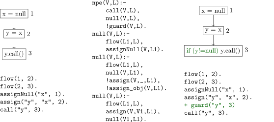

## Abstract

Datalog has proven to be a powerful language for encoding program analyses, but its connection to program transformations remains underexplored. This paper investigates how ideas from database repair, data provenance, and symbolic execution can bridge the gap between using Datalog for program analysis and leveraging it for program transformations.
We survey existing approaches and present an upcoming perspective on the symbolic execution of Datalog rules, which simultaneously enables the representation of a space of potential input database (program) changes and computing their effect on the analysis results.
We posit that bridging Datalog's strengths for analysis with an ability to reason about and execute transformations would significantly expand its utility for program optimization, repair, and other transformations. 

## 1 Introduction

The use of deductive databases and logic programming languages, such as Datalog [^datalog], for program analysis is far from new [^reps1995demand][^whaley2004cloning][^lam2005context]. The declarativeness of Datalog makes it attractive for specifying complex analyses [^souffle][^madmax]. The ability to specify recursive definitions is particularly exciting, as program analysis is fundamentally a mixture of mutually recursive tasks (see [Figure 1](#analyses-deps-figure))

<!--  -->

Figure 1. A subset of program analyses illustrating a domain of mutual recursion

A Datalog query is a set of Horn clauses such as `path(X,Y) :- edge(X,Z), path(Z,Y).` executed against a database of facts referred to as the extensional database (EDB). The result is a set of derived facts, referred to as the intensional database (IDB).

Naturally, a program to be analyzed is represented as an EDB; e.g., control-flow graph (CFG) as a set of facts. When a query is executed on this EDB, an optimized Datalog engine computes all facts that can be inferred using the query's rules. A big advantage of this setup is the multitude of optimizations from the classical database systems that come for free to make these analyses efficient [^doop].

While connecting program analysis to databases (via Datalog) has proved useful, an open question is ***whether program transformations similarly translate to useful aspects of databases***.

Program transformations involve changes in a program to improve an objective. Reasoning about these changes is necessary in many practical applications. For example, while a program analysis can determine if a program's behavior violates a certain property, a valid repair (fix, exception handler, etc.) ensures a program that meets the desired property [^sadowski2018lessons]. Consequently, reflecting on what transformations lead to a desired property is of great interest.

## 2 Existing Connections

Starting from a Datalog view of programs represented as an EDB, we naturally arrive at program transformations being transformations to the corresponding facts in the database. Consequently, we can view the challenges of reflecting on these database transformations modulo a desired property in two phases. First, is the *reflection* aspect that answers what is the origin or derivation of an inferred fact? Second, the *transformation* aspect answers how a change to the input affects the truthfulness of the desired property.

There have been various approaches to support both these aspects in traditional database and Datalog frameworks, some of which we explore next.

### 2.1 Database Repair and Integrity Constraints

One well-studied desired property in traditional database applications is **Consistency**. Arenas et al. (1999) [^arenas1999consistent] define a database instance $r$ as *consistent* if $r$ satisfies a set of *integrity constraints* $IC$. They then logically characterize "consistent query answers in inconsistent databases". The intuitive interpretation here is that an answer to a query posed to a database that violates integrity constraints should be the same as that obtained from a minimally **repaired** version of the original database.

<table align="right">
  <tr>
    <th colspan="3">Student</th>
  </tr>
  <tr>
    <td>S1</td>
    <td>N1</td>
    <td>D1</td>
  </tr>
  <tr>
    <td>S1</td>
    <td>N2</td>
    <td>D1</td>
  </tr>
</table>

<table align="right">
  <tr>
    <th colspan="3">Course</th>
  </tr>
  <tr>
    <td>S1</td>
    <td>C1</td>
    <td>G1</td>
  </tr>
  <tr>
    <td>S1</td>
    <td>C2</td>
    <td>G2</td>
  </tr>
</table>

**Example:** Consider the student database shown above. `Student(x, y, z)` means that `x` is the student number, `y` is the student's name, and `z` is the address. The following Integrity Constraints (ICs) state that the first argument is the relation's key:

$$
\begin{align*}
\forall(x,y,z,u,v)(Student(x,y,z) \land Student(x,u,v) \supset y = u), \\
\forall(x,y,z,u,v)(Student(x,y,z) \land Student(x,u,v) \supset z = v).
\end{align*}
$$

The inconsistent database instance `r` (shown) has two repairs, each removing one of the tuples in `Student`. Considering all repairs, for a query $\exists{z}~ Course(S1, y, z)$, we obtain `C1` and `C2` as the consistent answers. However, for $\exists{(u,v)}~ (Student(u, N1, v) \land Course(u, x, y))$ we obtain no (consistent) answers.

This is interesting since a *repaired* database $r'$ was transformed to satisfy the desired integrity constraints $IC$. Of course, there could be many repairs for an inconsistent database.
Arenas et al. (1999) [^arenas1999consistent] hence propose a solution to retrieve consistent answers that use only the original database (despite inconsistency).
The idea is to syntactically transform a query $Q$, reinforcing residues of ICs locally, to a query $Q'$. Evaluating $Q'$ on the original database returns the set of consistent answers to the query $Q$. This avoids explicitly computing the repairs. Here's an example:

**Example:** Consider the integrity constraint $\forall{x} (\neg P(x) \lor Q(x))$. If $Q(x)$ is false, then $\neg P(x)$ must be true. So, when querying $\neg Q(x)$, we make sure to generate the below query, where the underlined part is the residue added: $\neg Q(x) \land \underline{\neg P(x)}$

**Challenges:** There are challenges in extending this directly to Datalog and program transformations. Mainly, queries and constraints here are limited to a fragment of first-order logic and rewritten into a new query in the same language. For instance, completeness is lost when it is applied to disjunctive or existential queries.

More work [^arenas2003answer][^bertossi2011database] along these lines have attempted to extend writing repair strategies in logical languages like Datalog, which are more expressive than FO logic.
However, scalability issues exist when writing and applying these to large rulesets, as in static analysis.

A bigger challenge in (directly) connecting this to Datalog for program transformation is that these approaches circumvent computing repairs entirely. This is of little applicability when the goal is to find a transformation.

### 2.2 Data Provenance and Debugging Datalog

While connections to database repair are apparent, another way to view transformations modulo a desired property is to look into **Data Provenance** for debugging why a property holds.

Despite the numerous advantages, the declarative semantics of Datalog poses a debugging challenge. Logic specifications lack the notion of state and state transitions. After evaluation, we can only view relations in their entirety without explaining the origin or derivation of data.

A standard solution for these explanations is a *proof tree* [^datalog]. A proof tree for a tuple describes the derivation of that tuple from input tuples and rules.
A valid proof tree (all nodes hold) can explain an unexpected tuple when debugging. A failed proof tree provides insight into why a tuple is not produced. [Figure 2](#proof-tree) shows an example of a proof tree for an alias analysis.

<!--  -->

Figure 2. Full proof tree for alias(a,b) in an alias analysis.

**Challenges:** However, these state-of-the-art techniques do not scale to large program analysis problems. Firstly, unlike top-down evaluation, scalable bottom-up Datalog evaluation does not have a notion of proof trees. Consequently, techniques propose rewriting the Datalog specification with provenance information [^deutch2015selective][^kohler2012declarative][^lee2017efficiently]. Here, a common issue is the need for re-evaluation when debugging, which can be expensive for industrial-scale static analysis problems (think something as precise as **Doop** [^doop], which may take multiple days for medium-to-large Java programs). Another major challenge is infinitely many proof trees and their conciseness—brute force search is infeasible, and storing proof trees during evaluation is memory intensive.

Recently, Zhao et al. (2020) [^zhao2020debugging] proposed storing *proof annotations* alongside tuples that include the height of the minimal proof tree and the rule that generated the tuple. Further, they extend the standard subset lattice of bottom-up evaluation as follows:

1. Define a *provenance instance* $(I, h)$ as an instance of tuples $I$ along with a function $h$ that provides a height annotation for each tuple in the instance.
2. Define a *provenance lattice* as one that follows the ordering:

$$
\begin{align*}
(I_1,h_1) \sqsubseteq (I_2,h_2) \Longleftrightarrow I_1 \subseteq I_2 \text{ and } \forall{t \in I_1}: h_1(t) \ge h_2(t)
\end{align*}
$$

3. Define the join of instances $(I, h)$ and $(I', h')$ as $(I \cup I', h'')$ where $h''$ is the minimum of $h$ and $h'$ for each tuple in the join.

Since bottom-up evaluation is equivalent to applying a monotone function to move "up" a lattice, this guarantees the minimality of these height annotations. During debugging, one can reconstruct one level of the minimal proof for a tuple $t$ using a top-down search. While we omit details here, the example below illustrates it:

**Example:** Say $alias(a,b)$ is the tuple of interest. From bottom-up evaluation, the height annotation is $h(alias(a,b))=4$, and the generating rule is $alias(X,Y) :- vpt(X,o), vpt(Y,o)$. Now, we can search for tuples for the body of this rule such that $X=a$, $Y=b$, $h(vpt(a,o))<4$, and $h(vpt(b,o))<4$. Finding these tuples forms a one-level proof tree.

Zhao et al. (2020) [^zhao2020debugging] find that this adds minimal overhead to Datalog evaluation while enabling debugging, even in **Doop**-like analysis generating millions of output tuples. This approach could take us one step further from program analysis to transformations with declarative approaches. Granularly reflecting on why we inferred a fact is particularly useful; it hints at potential transformation (repair) strategies.

Notably, this has been integrated into state-of-the-art Datalog engines like Soufflé [^souffleProvenance]. However, an aspect that remains unanswered is executing these transformations and viewing their effects.

### 2.3 Incrementality and Datalog

The incrementality of Datalog engines allows for analysis on the fly, on-demand, and online analysis. Interactive applications using this benefit could provide insights into how to reason EDB transformations.

**Example:** As an example, program analysis frameworks like **Doop** [^doop] evaluate a set of rules defined over the abstract syntax tree of the program. Integrating this into an IDE requires re-evaluating the rules after every few keystrokes (note, an ongoing transformation). The evaluation must preserve intermediate results efficiently to achieve interactive performance.

Datalog dialects such as Differential Datalog (DDLog) [^ddlog] have been proposed to make writing such applications easier. A DDlog programmer writes traditional, non-incremental Datalog programs. However, DDlog's execution model is fully incremental: at runtime, DDlog programs receive streams of changes to the input relations and produce streams of corresponding changes to derived relations.

This capability significantly benefits tools like Language Server Protocols (LSP) servers and compilers, providing developers with real-time feedback and suggestions. However, this solves only part of the problem, where one can reason about the effect of changes. What remains is the part where we *reflect* on what change would provide the desired effect.

Elastic incrementalization [^elastic-incremental][^zhao2023automatic] extends this by incorporating provenance annotations for input adjustments in incremental Datalog. They switch between a low-overhead Bootstrap strategy that targets high-impact updates and an Update strategy that targets low-impact updates.

## 3 A Symbolic Execution Perspective

In the previous sections, we cover various viewpoints on the challenge of reflecting on input transformations modulo a desired property in a Datalog setting. Some solve the transformation aspect (Database repair), and others the reflection aspect (Data provenance, Debugging, and Incremental Datalog). However, a unification of the two within standard Datalog remains to bridge the use of Datalog from pure program analyses to transformations.

Consequently, one must be able to represent changes to the input and then execute them to view how they affect the output, all in standard Datalog. Hence, the key missing pieces are:

1. How to represent a change $\Delta(EDB)$ in standard Datalog?
2. How to execute $\Delta(EDB)$ in standard Datalog, such that, we can reflect on a map $\Delta(EDB) \mapsto \Delta(IDB)$?

Liu et al. (2023) [^liu2023program] presented one solution. They discuss an instantiation of the larger problem in program repair (a specific program transformation). An example of the setup is illustrated in [Figure 3](#repair). With this setup, one can identify bugs (such as null pointer exceptions) using a Datalog query over program facts. The result is an observed fact, say `npe("y", 3)`, that suggests the presence of the bug. Additionally, as seen in the section on Data Provenance and referenced in [Figure 2](#proof-tree), one can derive a proof tree that describes the derivation of the observed fact.

<!--  -->

Figure 3: (left) A program with a null pointer exception (NPE), (middle) an analysis that detects it, and (right) a repair that fixes it--all visualized in a Datalog setting for program analyses.

### Motivation: SymEx for Program Repair

Popular research in automated program repair uses symbolic execution and testing. Nguyen et al. (2013) [^semfix][^angelix] proposed **SemFix**, where the authors reformulated the requirement on the repaired code to pass a given set of tests as a constraint. **SemFix** generates repair constraints via controlled symbolic execution [^symex-select] of the program. Such a constraint is then solved by iterating over a space of repair expressions. Here, the key idea is in modeling the problem: abstract a given program by injecting symbols and executing the program symbolically to infer repair constraints. Solving these constraints results in potential repairs.

Liu et al. (2023) [^liu2023program] extend this idea to Datalog. They introduce the notion of **Symbolic Execution of Datalog** (SEDL) that determines how a change to the EDB affects the output of a given query, the details of which are described next.

#### Symbolic Execution of Datalog

A set of changes to the database can be encoded using symbols. Liu et al. (2023) [^liu2023program] introduce three types of symbols: (1) symbolic constants ($\alpha$'s) that represent unknown constants, (2) symbolic predicates ($\rho$'s) for unknown predicates, and (3) symbolic signs ($\xi$'s) for unknown truthfulness of facts. These symbols can be used to inject and encode a large space of changes to the EDB, as shown below:

**Example.** For instance, consider the EDB in [Figure 3](#repair). Injecting symbolic facts into it could result in a symbolic EDB as follows:

$$
\begin{align*}
&\xi_1 \text{ flow}(1, 2).  \ \ \ \ \ \ \ \ \ \ \ \ \ \ \ \ \text{assignNull}("x", 1). \\
&\xi_2 \text{ flow}(2, 3).  \ \ \ \ \ \ \ \ \ \ \ \ \ \ \ \ \text{call}("y", 3).\\
&\xi_3 \text{ flow}(\alpha_1, \alpha_2). ~~~~~~~~~~~~\xi_5 \text{ flow}(\alpha_4, 3).\\  
&\xi_4 \text{ flow}(\alpha_2, \alpha_3). ~~~~~~~~~~~~\xi_6 \text{ assignObj}(\alpha_5, \alpha_6). \\
&\text{assignNull}("x", 1).
\end{align*}
$$

Any valuation of these symbols corresponds to a concrete EDB (including the original one). Next, these sets of changes (encoded as symbols) are "executed" using standard Datalog. To do so, Liu et al. (2023) [^liu2023program] propose a meta-programming approach. They encode the query and symbolic EDB into a meta-program using transformation rules. The meta-program uses auxiliary variables in the relations to capture the bindings for the symbols introduced. An example is discussed below:

**Example:** Consider the rule `null(V,L):- flow(L1, L), assignNull(V, L1).` that calculates when a variable is `null`. Each predicate in a rule like this is augmented with variables for each symbol introduced. These auxiliary variables store the assignments to their corresponding symbols:

$$
\begin{align*}
&\text{null}(V,L, C1, \ldots, Cn):- \text{ flow}(L1, L, C1, \ldots, Cn), \text{ assignNull}(V, L1, C1, \ldots, Cn); \\
\end{align*}
$$

As shown, the rules also propagate the values bound to these symbols. Similarly, a symbolic EDB fact such as $\text{flow}(\alpha_1, 2)$ is converted to a rule that enumerates values from the domain of the symbol used:

$$
\begin{align*}
&\text{flow}(C1, 2, C1, \ldots, Cn) :- \text{ dom-}\alpha_1(C1), \ldots, \text{ dom-}\alpha_n(Cn)
\end{align*}
$$

When executed, the values in these binding variables will capture the **assignment constraints that should hold** for the corresponding fact. A similar strategy is used to bind symbolic predicates that identify **which predicate instantiation is needed** to infer a fact. Lastly, bindings for symbolic signs represent whether the output fact **can be inferred with or without relying on a symbolic signed fact**.

The overall semantics of symbolically executing a Datalog program $P$ can thus be described as a function $\mathcal{S}_P:2^{SEHB} \to 2^{SIHB \times \Phi}$. That is, each inferred fact in the symbolic intentional database (SIHB) is accompanied by an **Inference Condition** $\Phi$ that summarizes the values of auxiliary variables. This condition defines under what constraint the output fact is generated (similar to path conditions in conventional symbolic execution). For instance, the fact $npe(y, 3)$ could be accompanied by the following condition:

<!--  -->
 

Consequently, $\neg \Phi$ represents the constraint under which the corresponding fact is not true. This closes the loop for program repair, since $\neg \Phi$ is essentially a **repair constraint**—any solution for it is a valid repair or change to the EDB. These perspectives and ideas introduced to Datalog could potentially be extended beyond program repair.\

## 4 Conclusion

In this paper, we survey existing work to answer the question: *Can program transformations be translated to useful aspects of Datalog?* In light of this question, we looked at connections to databases in two directions. First, we studied the origins or derivation of a fact, found existing connections to database repair modulo integrity constraints, and unveiled challenges with them. Further, we find research on data provenance, Datalog augmented with lattices, and debugging Datalog quite relevant to the question at hand. Finally, we cover recent efforts in program repair (an example of a program transformation) that propose a symbolic execution perspective to this problem. Overall, this survey describes and connects several related ideas and provides a basis for future research on Datalog-based program transformations.

## References

[^datalog]: S. Abiteboul, R. Hull, and V. Vianu, Foundations of databases, vol. 8. Addison-Wesley Reading, 1995.

[^reps1995demand]: T. W. Reps, ‘Demand interprocedural program analysis using logic databases’, in Applications of Logic Databases, Springer, 1995, pp. 163–196.

[^whaley2004cloning]: J. Whaley and M. S. Lam, ‘Cloning-based context-sensitive pointer alias analysis using binary decision diagrams’, in Proceedings of the ACM SIGPLAN 2004 conference on Programming Language Design and Implementation, 2004, pp. 131–144.

[^lam2005context]: M. S. Lam et al., ‘Context-sensitive program analysis as database queries’, in Proceedings of the twenty-fourth ACM SIGMOD-SIGACT-SIGART symposium on Principles of database systems, 2005, pp. 1–12.

[^souffle]: H. Jordan, B. Scholz, and P. Subotić, ‘Soufflé: On synthesis of program analyzers’, in Computer Aided Verification: 28th International Conference, CAV 2016, Toronto, ON, Canada, July 17-23, 2016, Proceedings, Part II 28, 2016, pp. 422–430.

[^madmax]: N. Grech, M. Kong, A. Jurisevic, L. Brent, B. Scholz, and Y. Smaragdakis, ‘Madmax: Surviving out-of-gas conditions in ethereum smart contracts’, Proceedings of the ACM on Programming Languages, vol. 2, no. OOPSLA, pp. 1–27, 2018.

[^doop]: M. Bravenboer and Y. Smaragdakis, ‘Strictly declarative specification of sophisticated points-to analyses’, in Proceedings of the 24th ACM SIGPLAN conference on Object oriented programming systems languages and applications, 2009, pp. 243–262.

[^sadowski2018lessons]: C. Sadowski, E. Aftandilian, A. Eagle, L. Miller-Cushon, and C. Jaspan, ‘Lessons from building static analysis tools at google’, Communications of the ACM, vol. 61, no. 4, pp. 58–66, 2018.

[^arenas1999consistent]: M. Arenas, L. Bertossi, and J. Chomicki, ‘Consistent query answers in inconsistent databases’, in Proceedings of the eighteenth ACM SIGMOD-SIGACT-SIGART symposium on Principles of database systems, 1999, pp. 68–79.

[^arenas2003answer]: M. Arenas, L. Bertossi, and J. Chomicki, ‘Answer sets for consistent query answering in inconsistent databases’, Theory and practice of logic programming, vol. 3, no. 4–5, pp. 393–424, 2003.

[^bertossi2011database]: L. Bertossi, Database Repairs and Consistent Query Answering. Morgan & Claypool Publishers, 2011.

[^deutch2015selective]: D. Deutch, A. Gilad, and Y. Moskovitch, ‘Selective provenance for datalog programs using top-k queries’, Proceedings of the VLDB Endowment, vol. 8, no. 12, pp. 1394–1405, 2015.

[^kohler2012declarative]: S. Köhler, B. Ludäscher, and Y. Smaragdakis, ‘Declarative datalog debugging for mere mortals’, in International Datalog 2.0 Workshop, 2012, pp. 111–122.

[^lee2017efficiently]: S. Lee, S. Köhler, B. Ludäscher, and B. Glavic, ‘Efficiently computing provenance graphs for queries with negation’, arXiv preprint arXiv:1701. 05699, 2017.

[^zhao2020debugging]: D. Zhao, P. Subotić, and B. Scholz, ‘Debugging large-scale datalog: A scalable provenance evaluation strategy’, ACM Transactions on Programming Languages and Systems (TOPLAS), vol. 42, no. 2, pp. 1–35, 2020.

[^souffleProvenance]: [Soufflé Provenance](https://souffle-lang.github.io/provenance)

[^ddlog]: L. Ryzhyk and M. Budiu, ‘Differential Datalog’, Datalog, vol. 2, pp. 4–5, 2019.

[^elastic-incremental]: D. Zhao, P. Subotic, M. Raghothaman, and B. Scholz, ‘Towards elastic incrementalization for datalog’, in Proceedings of the 23rd International Symposium on Principles and Practice of Declarative Programming, 2021, pp. 1–16.

[^zhao2023automatic]: D. Zhao, P. Subotić, M. Raghothaman, and B. Scholz, ‘Automatic Rollback Suggestions for Incremental Datalog Evaluation’, in International Symposium on Practical Aspects of Declarative Languages, 2023, pp. 295–312.

[^liu2023program]: Y. Liu, S. Mechtaev, P. Subotić, and A. Roychoudhury, ‘Program Repair Guided by Datalog-Defined Static Analysis’, in Proceedings of the 31st ACM Joint European Software Engineering Conference and Symposium on the Foundations of Software Engineering, 2023, pp. 1216–1228.

[^semfix]: H. D. T. Nguyen, D. Qi, A. Roychoudhury, and S. Chandra, ‘Semfix: Program repair via semantic analysis’, in 2013 35th International Conference on Software Engineering (ICSE), 2013, pp. 772–781.

[^angelix]: S. Mechtaev, J. Yi, and A. Roychoudhury, ‘Angelix: Scalable multiline program patch synthesis via symbolic analysis’, in Proceedings of the 38th international conference on software engineering, 2016, pp. 691–701.

[^symex-select]: R. S. Boyer, B. Elspas, and K. N. Levitt, ‘SELECT—a formal system for testing and debugging programs by symbolic execution’, ACM SigPlan Notices, vol. 10, no. 6, pp. 234–245, 1975.

